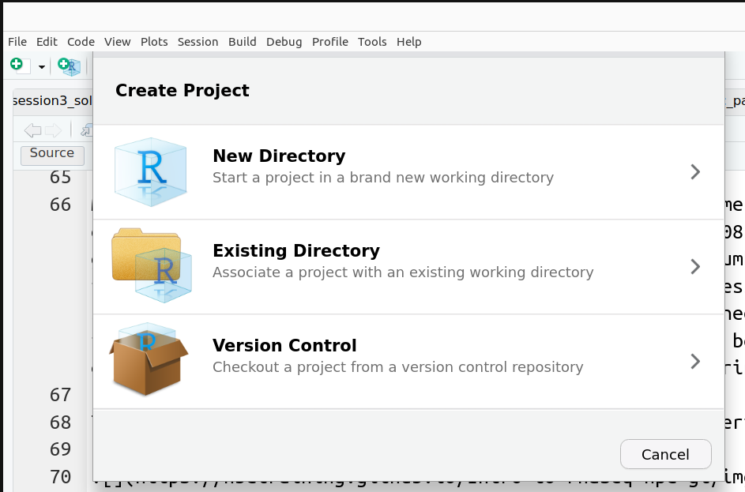
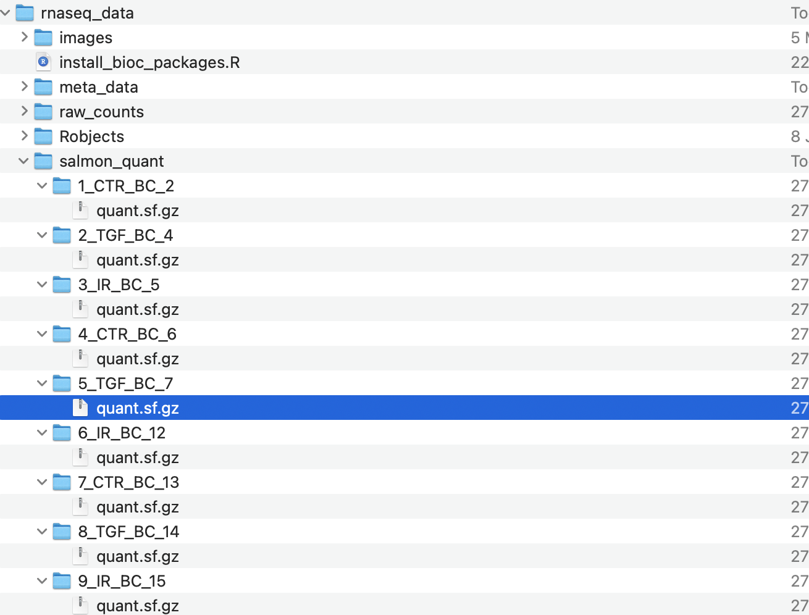
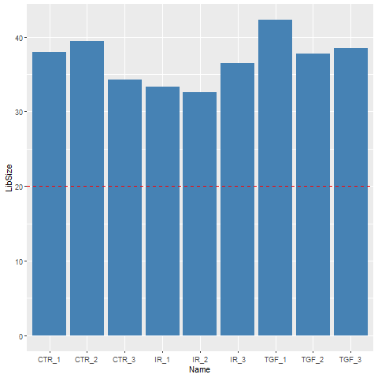
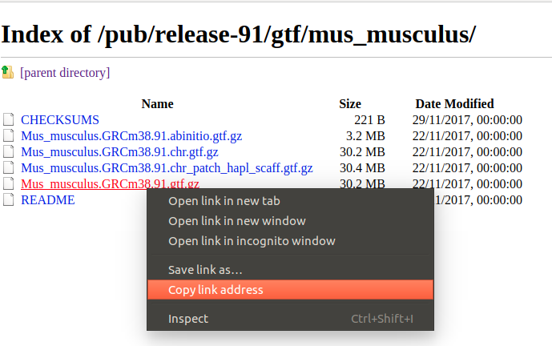

```{r knitrOpts, include=FALSE}
knitr::opts_chunk$set(echo = TRUE,message=FALSE,warning=FALSE)
```

# Workshop Overview

High-throughput sequencing is now established as a standard technique for many functional genomics studies; allowing the researcher to compare and contrast the transcriptomes of many individuals to obtain biological insight. A high-volume of data are generated from these experimental techniques and thus require robust and reproducible tools to be employed in the analysis.

In this workshop, you will be learning how to analyse RNA-seq count data, using R. This will include reading the data into R, quality control and performing differential expression analysis and gene set testing, with a focus on the well-respected DESEq2 analysis workflow. You will learn how to generate common plots for analysis and visualisation of gene expression data, such as boxplots and heatmaps. 


<div class="information">
We will be discussing **Bulk** RNA-seq only, although some of the methods and techniques will be applicable to *single-cell* RNA-seq. We are planning single-cell RNA-seq training in the future. In the meantime, the homepage for Seurat (a popular R package for single-cell analysis) has lots of useful tutorials.

- [Analysis of Single-cell RNA-seq data - Jan 20th 2023](https://sbc.shef.ac.uk/training/single-cell-2023-01-30/)
- [Seurat Home page](https://satijalab.org/seurat/)

</div>

## Learning outcomes

After this workshop the successful learner will have a practical understanding of:

- Exploring RNA-seq count data and importing these data into R
- Normalisation strategies for RNA-seq counts
- Quality Assessment of counts
- Identifying outliers, batch effects and sample mix-ups
- Using the DESeq2 package to assess differential expression
- Construction and interpretation of common visualisations
- Using annotation packages to query biological databases
- Methodology behind gene set testing and enrichment analysis

## Teaching Style

- Pre-written *markdown* and compiled HTML files
  + links from the google doc
- Live-teaching sessions to create a new markdown to document the analysis
  + including "breakout sessions" for exercise and questions

## Setup

If you are following these notes online independent of our of our workshops, you will need to install some R packages before you start. To do this, copy the following into the RStudio console and press enter

```{r}
source("https://raw.githubusercontent.com/sheffield-bioinformatics-core/rnaseq-r-online/main/install_bioc_packages.R")
```

To check that everything worked, now copy and paste the following command. It should print messages to the screen to say that all the packages were installed

```{r}
source("https://raw.githubusercontent.com/sheffield-bioinformatics-core/rnaseq-r-online/main/check_packages.R")

```

You will also need to download a zip file containing some example RNA-seq data. The zip file also has R markdown files that you can follow along with

- [Data Download link](https://drive.google.com/file/d/178yZSaG1tTr3akeN0DQ2f1Pu2rMoJkBT/view?usp=sharing)

Once you have downloaded the zip file, you will need to *extract* the files to a location on your computer that you would like to work from. We recommend that you create an **RStudio project** from the directory that the files are extracted to.

**File** -> **New Project** -> **Existing Directory**




# Learning objectives - Session 1

- Exploring count data and importing these data into R
- Normalisation strategies for RNA-seq counts
- Quality Assessment of counts
- Identifying outliers, batch effects and sample mix-ups


# Introduction

Measuring gene expression on a genome-wide scale has become common practice over the last two decades or so, with microarrays predominantly used pre-2008. With the advent of next generation sequencing technology in 2008, an increasing number of scientists use this technology to measure and understand changes in gene expression in often complex systems. As sequencing costs have decreased, using RNA-Seq to simultaneously measure the expression of tens of thousands of genes for multiple samples has never been easier. The cost of these experiments has now moved from generating the data to storing and analysing it.

There are many steps involved in analysing an RNA-Seq experiment. 


Workflow image from Harvard Bioinformatics Core

Analysing an RNAseq experiment begins with sequencing reads. These are large (typically several Gb) that contain information on the sequences that have been generated for each biological sample; one fastq (or pair of fastqs) for each sample. Each set of four lines describe one sequence (called a "read").

A typical RNA-seq experiment will have 10 - 30 million reads in a fastq file, with each read about 100 bases long

```
@D0UW5ACXX120511:8:1204:6261:40047/1
AATGTTTATGTTCTTAAATTTTAGTTGTATATGTGAATCTTTGTAGTTTTTGCTAAAATACTAAGTAATTTATATAAAAGTGAGTTAAGAGATTTTTCTGA
+
CCCFFFFFHHHHHJJJJJIJJJJJIJJHIIJIJIJJIJJJIJJHIIHIJJJJJJBEGIHIJICGIDICFGIJJJIIJJGJ>F>GAGCGEEHEHHEEFFFD>
```

As the fastq files are large, we tend to analyse them using command-line software and a computing cluster. The *traditional workflow for RNA-seq* compares the sequences to a reference genome to see which genomic region each read matches the best.


Again, this requires more memory than a typical laptop or desktop machine so is performed on a remote computer with large memory. The resulting file is called a *bam* and records the best genomic match for each read. However, as we are interested in gene expression we want to relate these mappings to the positions of genes.


A variety of different counting methods can determine how many reads overlap each known gene region. These are know as the raw counts and are the kind of data we will start with today.


Recent tools for RNA-seq analysis (e.g. `salmon`, `kallisto`) do not require the time-consuming step of whole-genome alignment to be performed, and can therefore produce gene-level counts in a much faster time frame. They not require the creation of large bam files, which is useful if constrained by file space  (e.g. if using Galaxy).

<div class="information">
If you want to know more about genome alignment and command-line tools we have an upcoming workshop. We also have a workshop on using the free online resource Galaxy for RNA-seq pre-processing

- [RNA-seq pre-processing in Galaxy](https://sbc.shef.ac.uk/ngs_intro_workshop/03-rna-seq.nb.html)
- [RNA-seq pre-processing with command-line](https://sbc.shef.ac.uk/training/command-line-2023-01-16/)

</div>

Although we will be following a workflow that uses the `DESeq2` package, an alternative workflow is available based on the [edgeR and limma packages](https://bioconductor.github.io/BiocWorkshops/rna-seq-analysis-is-easy-as-1-2-3-with-limma-glimma-and-edger.html).

### Example dataset

The data for this tutorial comes from the paper, [*Induction of fibroblast senescence generates a non-fibrogenic myofibroblast phenotype that differentially impacts on cancer prognosis.*](http://europepmc.org/article/MED/27992856). 

> Cancer associated fibroblasts characterized by an myofibroblastic phenotype play a major role in the tumour microenvironment, being associated with poor prognosis. We found that this cell population is made in part by senescent fibroblasts in vivo. As senescent fibroblasts and myofibroblasts have been shown to share similar tumour promoting functions in vitro we compared the transcriptosomes of these two fibroblast types and performed RNA-seq of human foetal foreskin fibroblasts 2 (HFFF2) treated with 2ng/ml TGF-beta-1 to induce myofibroblast differentiation or 10Gy gamma irradiation to induce senescence. We isolated RNA 7 days upon this treatments changing the medium 3 days before the RNA extraction.

The sequencing reads for this experiment were uploaded to [ArrayExpress](https://www.ebi.ac.uk/arrayexpress/experiments/E-MTAB-3101/) and processed using `salmon`. However, the workflow we will describe can be applied to other sources of count data.

<div class="information">
A really useful resource for obtaining raw sequencing reads is sraexplorer. Given a GEO, ArrayExpress of SRA dataset name it will give you links to download the raw fastq files

- [SRA Explorer](https://sra-explorer.info/)

</div>


# Obtaining the metadata

We refer to *metadata* as the data that describes the biological and technical characteristics of the samples we have sequenced. Examples of variables recorded in the metadata might include.

- tumour / normal status
- cell line
- age
- gender
- date of collection
- litter

We include the sample groups that we want to compare, and any potential *confounding factors* that we might need to address as part of our quality assessment. The metadata is stored in a spreadsheet and typically entered by-hand. When creating such data we should be mindful of some best-practice guidelines that will make our data easier to read into R.

<div class="information">
See here for a round-up of common errors to be avoiding when creating spreadsheets

- [Data Carpentry lesson on spreadsheet errors](https://datacarpentry.org/spreadsheet-ecology-lesson/02-common-mistakes)
</div>

The `sampleInfo.txt` in the `meta_data` folder contains basic information about the samples that we will need for the analysis today. This includes the ID for the sample from SRA, an ID assigned by the researcher, and the cell type and developmental stage for each sample.

```{r loadSampleInfo}
# Read the sample information into R
library(readr)
sampleinfo <- read_csv("meta_data/sampleInfo.csv")
View(sampleinfo)
sampleinfo
```


# Reading in the count data


## Output from salmon

Eventually we will be using the DESeq2 Bioconductor package for differential expression analysis. The specific method of importing your count data into DESeq2 depends on the workflow used to generate the counts. The [DESeq2 vignette](https://bioconductor.org/packages/release/bioc/vignettes/DESeq2/inst/doc/DESeq2.html#input-data) gives many different use-cases. For instance, if you have your counts in a single file (e.g. if following our Galaxy tutorials) you can follow the example later in this tutorial.

### Overview

After following our R introductory workshops ([https://sbc.shef.ac.uk/r-online/part1.nb.html](https://sbc.shef.ac.uk/r-online/part1.nb.html)), we should be familiar with reading files into R. As we will see, the count data we want to import and text files with a simple structure. However, an RNA-seq experiment may consist of several large files and the techniques we have seen for reading files generally only read a single file at a time. There are often Bioconductor packages or reading input data more efficiently.

We are going to use the [`tximport`](http://dx.doi.org/10.12688/f1000research.7563.1) package to import our count data into R and collapse the data to the *gene level*. This requires us to run a function in the following form:-

```{r eval=FALSE}
txi <- tximport(files=..., type="salmon", tx2gene=...)
```

So we will need to define the files that we want to import and a transcript mapping data frame. The transcript mapping takes the form:-

```
 | TXNAME | GENEID
1| ENST00000456328.2 |  ENSG00000223972.5
2| ENST00000450305.2 | ENSG00000223972.5
3| ENST00000473358.1 | ENSG00000243485.5
4| ENST00000469289.1 | ENSG00000243485.5
5| ENST00000607096.1 | ENSG00000284332.1
6| ENST00000606857.1 | ENSG00000268020.3
```

`tximport` is able to import counts produced by different software, and different workflows are described for each in the [tximport vignette](https://bioconductor.org/packages/devel/bioc/vignettes/tximport/inst/doc/tximport.html).

### Identifying the files

The samples from this study have been *quantified* using `salmon`, which is beyond the scope of this workshop. Note that the salmon analysis produced many other files (e.g. log files), but we will only need the `quant.sf.gz` files for analysis.

The function we are going to use to import the salmon files requires a `vector` comprising the paths to the files that are to be imported. The code will be written assuming the following folder structure:-



- The salmon files are found in a folder called `salmon_quant`
- The output for each sample is in a separate folder; named according to sample name
- The salmon file has the name `quant.sf.gz` (these have been zipped to save space)

The files can be found using the in-built function `list.files`. (`?list.files` for help on this function). We can also name each item in the vector according to the directory name. These names will be used eventually to name the columns of our count matrices.

```{r}
dirs <- list.files("salmon_quant/")
quant_files <- list.files("salmon_quant/",
                          pattern="quant.sf.gz",
                          recursive = TRUE,
                          full.names = TRUE)
names(quant_files) <- dirs
quant_files
```

<div class="information">
If running this code on your own data, you may need to adjust the code to create `quant_files` accordingly.
</div>


Our differential expression analysis will be carried-out at the *gene-level*, so we need to perform an additional level of summarisation before we can proceed. Effectively we need to sum the counts for all transcripts that belong to each gene. The *mappings* from transcript to genes can be obtained by a pre-built database (such as Ensembl). We have provided such data in a csv file that we can read in (`tx2gene.csv`). See the Appendix if you want to know the details


```{r}
tx2gene <- read_csv("tx2gene.csv")
head(tx2gene)
```
We can now import our dataset with the `tximport` package. 

```{r}
library(tximport)
txi <- tximport(quant_files,
                type="salmon",
                tx2gene = tx2gene)
```

The resulting object is a "*list*" structure in R which contains a number of components that we can access using a `$` operator

The raw counts can be found using `txi$counts`. The names of each column are the sample names. If we had not defined the `names` of the `quant_files` vector the columns would just have numbers which would not be useful for downstream analysis.

```{r}
head(txi$counts)
```
`

# Quality control of the imported counts

We will be using the `DESeq2` library to analyse this dataset. Along with the counts and metadata, a *design* for the experiment also needs to be specified. This will define how the differential expression analysis is carried out, but can be changed at a later stage so for now we will use `Treated` as our factor of interest.


Printing the contents of `dds` to the screen gives details of how the data are represented.

```{r message=FALSE}
library(DESeq2)
dds <- DESeqDataSetFromTximport(txi, 
                                colData = sampleinfo,
                                design = ~Treated)
dds
```


The object contains all the counts which can be retrieved using the `counts` function. 
```{r}
head(counts(dds))
```

Whereas `colData` will display the meta data that has been stored with the object.

```{r}
colData(dds)
```

Individual columns from the metadata can also be accessed and printed using the `$` notation

```{r}
dds$condition
dds$Treated
```

The metadata columns can also be re-assigned. This useful in this case because we can see that `condition` is not stored as a factor, which could cause problems later on when we want to use `condition` in the differential expression.

```{r}
dds$condition <- as.factor(dds$condition)
```


### Visualising library sizes

We can look at a few different plots to check that the data is good quality, and that the samples are behaving as we would expect. First, we can check how many reads we have for each sample in the `DESeqDataSet`. The counts themselves are accessed using the `assay` function; giving a matrix of counts. The sum of a particular column is therefore the total number of reads for that sample.

```{r}
sum(counts(dds)[,1])
```

A convenience function `colSums` exists for calculating the sum of each column in a matrix, returning a `vector` as a result.

```{r dgeLibrarySizes}
colSums(counts(dds))

```


## Exercise

<div class="exercise">
- Use an appropriate function from `dplyr` to add a column containing the number of reads for each sample to the `sampleinfo` data frame.
- Produce a bar plot to show the Millions of reads for each sample (see below)
- **EXTRA** The following message appears when we run `tximport`:- `transcripts missing from tx2gene: 1`. Look back at the column headings of the `tx2gene` data frame and determine why this might be. How can we write the code to read `tx2gene.csv` differently and avoid this message.
</div>




### Visualising count distributions

We typically use a `boxplot` to visualise difference the distributions of the columns of a numeric data frame. Applying the `boxplot` function to the raw counts from our dataset reveals something about the nature of the data; the distributions are dominated by a few genes with very large counts. We are using the base `boxplot` function here because the count data are not in the *long* data format required by `ggplot2`.

```{r}
boxplot(counts(dds))
```


We can use the `vst` or `rlog` function from `DESeq2`to compensate for the effect of different library sizes and put the data on the log$_2$ scale. The effect is to remove the dependence of the variance on the mean, particularly the high variance of the logarithm of count data when the mean is low. For more details see the [DESeq2 vignette](http://bioconductor.org/packages/devel/bioc/vignettes/DESeq2/inst/doc/DESeq2.html#count-data-transformations)


```{r}
# Get log2 counts
vsd <- vst(dds,blind=TRUE)
# Check distributions of samples using boxplots
boxplot(assay(vsd), xlab="", ylab="Log2 counts per million",las=2,main="Normalised Distributions")

abline(h=median(assay(vsd)), col="blue")
```


## Principal components Analysis (PCA) 

<div class="information">
See here for a nice explanation of PCA

- [https://www.youtube.com/watch?v=0Jp4gsfOLMs](https://www.youtube.com/watch?v=0Jp4gsfOLMs)
</div>

The [(Principal Components Analysis) PCA](http://setosa.io/ev/principal-component-analysis/) plot, shows the samples in the 2D plane spanned by their first two principal components. A PCA is an example of an unsupervised analysis, where we don’t need to specify the groups. If your experiment is well-controlled and has worked well, what we hope to see is that the greatest sources of variation in the data correspond to the treatments/groups we are interested in. It is also an incredibly useful tool for quality control and checking for outliers.

`DESeq2` has a convenient `plotPCA` function for making the PCA plot, which makes use of the `ggplot2` graphics package. 


```{r}
plotPCA(vsd,intgroup="condition")
```

There is also an option to return the values used in the plot for further exploration and customisation. Here we join the PCA results to the meta-data (`sampleinfo`) for plotting.

```{r}
library(dplyr)
library(ggplot2)
plotPCA(vsd,intgroup="Treated",returnData = TRUE) %>% 
  dplyr::rename(Run = name) %>% 
  left_join(sampleinfo) %>% 
  ggplot(aes(x = PC1, y = PC2,col=group)) + geom_point()
```

## Exercise

<div class="exercise">

- Is the `plotPCA` plot based on all genes in the dataset? How can we change how many genes are used for the PCA analysis? Does this significantly change the plot? (HINT: check the documentation for the `plotPCA` function.)
- Verify that the samples are separated based on the type of treatment applied
- What problems can you see with the metadata?
- Can you label the identify of each sample? Look for help on `geom_text`if you haven't used it before
</div>

### Note about batch effects

In our unsupervised analysis we should see that the main source of variation is due to biological effects, and not technical variation such as when the libraries were sequenced. If we do observe high technical variation in our data, it is not a complete disaster provided that we have designed our experiment properly. In particular the [sva Bioconductor package](https://bioconductor.org/packages/release/bioc/vignettes/sva/inst/doc/sva.pdf) can correct for batch effects provided that representatives of the groups of interest appear in each batch. Alternatively, the batch or confounding factor may be incorporated into the differential expression analysis.

Below is an example of a PCA that might potentially worrying:-


### Correcting the sample information

The person creating the sample sheet has been inconsistent about the way that values of `Treated` have been entered into the metadata. Such errors can be annoying when labeling plots, but have more serious consequences when attempting to fit statistical models to the data.

Here are a set of commands to create an updated sample sheet using the `stringr` package (part of `tidyverse`). We write a new file rather than over-writing the existing one.

```{r correctSampleSheet}
library(stringr)
library(dplyr)
sampleinfo %>% 
mutate(condition = str_to_upper(condition)) %>% 
write_tsv(file="meta_data/sampleInfo_corrected.txt")
```


# Count matrix input

Another common workflow is where the raw counts are presented in the form of a single file with one column for each sample and one row for each gene.

Such a file is provided in the `raw_counts` folder.

```{r}
count_file <- "raw_counts/raw_counts_matrix.tsv"
counts <- read.delim(count_file)
head(counts)

```

The function `DESeqDatasetFromMatrix` can now be used to create the DESeq2 object. From the help (`?DESeqDatasetFromMatrix`) we can see that it requires similar arguments to before; a count object, sample information and a design. However, an error is printed with the code below:-

```{r eval=FALSE}
dds_from_mat <- DESeqDataSetFromMatrix(counts, 
                                  colData = sampleinfo, 
                                  design = ~Treated)
```

```
Error in DESeqDataSetFromMatrix(counts, colData = sampleinfo, design = ~Treated) : ncol(countData) == nrow(colData) is not TRUE
```

The error message is telling using that the number of columns in our count data is not the same as the number of rows in our sample information. This is indeed the case.

```{r}
ncol(counts)
nrow(sampleinfo)
```

A workaround is to modify our counts so that the gene names appear as *row names*, and then remove the gene names column. We can use the `[]` approach from base R to extract and remove columns.

```{r}
rownames(counts) <- counts[,1]
counts <- counts[,-1]

dds_from_mat <- DESeqDataSetFromMatrix(counts, 
                                  colData = sampleinfo, 
                                  design = ~Treated)
dds_from_mat
```

However, there is an simpler approach in this case. The function includes a `tidy` argument which can be set to `TRUE` in the situation where gene names appear as the first column.

```{r}
counts <- read.delim(count_file)
dds_from_mat <- DESeqDataSetFromMatrix(counts, 
                                  colData = sampleinfo, 
                                  design = ~Treated,
                                  tidy=TRUE)
dds_from_mat

```


# Exercise for next time

<div class="exercise">

- Re-create the `DESeqDataset` object to include the corrected sample information
- Re-run the plotPCA function on the new data and verify that the sample groups now look correct

</div>

# Appendix

### Defining the transcript mapping


In order for `tximport` to give *gene-level* counts, we need to supply a data frame that can be used to associate each transcript name with a gene identifier. **It is important to use a transcript file that corresponds to the name genome build as the file used to count the transcripts**. 

We can check if the `gtf` file exists in the directory we expect by running the `file.exists` function; returning `TRUE` or `FALSE`

```{r}
gtf_file <- "Mus_musculus.GRCm38.91.chr.gtf.gz"
file.exists(gtf_file)
```

If required, we can download from the Ensembl FTP site. 


```{r eval=FALSE} 
download.file("ftp://ftp.ensembl.org/pub/release-91/gtf/mus_musculus/Mus_musculus.GRCm38.91.chr.gtf.gz",destfile = gtf_file)

```


### Note on analysing your own data



If analysing your own data, you will have to locate the gtf file on the Ensembl FTP site. If you enter `ftp://ftp.ensembl.org/pub/release-91/gtf` into a web browser you will be able to navigate the site and find your organism of interest. By right-clicking on the name of the gtf you will be able to copy the URL and then paste into RStudio.

```{r eval=FALSE}
gtf_file <- "ensembl_ref/my_ref.gtf"
download.file(PASTE_LINK_FROM_ENSEMBL_HERE,destfile = gtf_file)
```

### Creating a transcript database

The Bioconductor website provides many pre-built transcript databases for some organisms (Human, Mouse, Rat etc)  which provide transcript definitions and allow users to query the locations of particular genes, exons and other genomic features. You may find a pre-built package that already has the transcript locations required to create the transcript mapping file. Check out the annotation section of the Bioconductor website - http://bioconductor.org/packages/release/BiocViews.html#___AnnotationData and look for packages starting `TxDb...`

However, it is quite easy to build such a database if we have a `gtf` file using the `GenomicFeatures` infrastructure.

```{r message=FALSE,eval=FALSE}
## Could take a few minutes to run the makeTxDbFromGFF command
library(GenomicFeatures)
txdb <- makeTxDbFromGFF(gtf_file)
```

The database has a number of predefined "keys" and "columns" that have to be specified when creating a query

```{r,eval=FALSE}
keytypes(txdb)
```

```{r,eval=FALSE}
columns(txdb)
```

Sometimes we would want to query the positions for a limited set of selected genes (perhaps the results of a differential-expression analysis), but in this case we want the gene names that correspond to every transcript in the database. To get the names of all transcripts we can use the `keys` function. We then compose the query using the `select` function to return a data frame

```{r,eval=FALSE}
k <- keys(txdb, keytype="TXNAME")
tx_map <- select(txdb, keys = k, columns="GENEID", keytype = "TXNAME")
head(tx_map)
```


# Acknowledgement 
**Original Authors: Belinda Phipson, Anna Trigos, Matt Ritchie, Maria Doyle, Harriet Dashnow, Charity Law**, **Stephane Ballereau, Oscar Rueda, Ashley Sawle**
Based on the course [RNAseq analysis in R](http://combine-australia.github.io/2016-05-11-RNAseq/) delivered on May 11/12th 2016 and modified by Cancer Research Uk Cambridge Centre for the [Functional Genomics Autumn School 2017](https://bioinformatics-core-shared-training.github.io/cruk-autumn-school-2017/)


