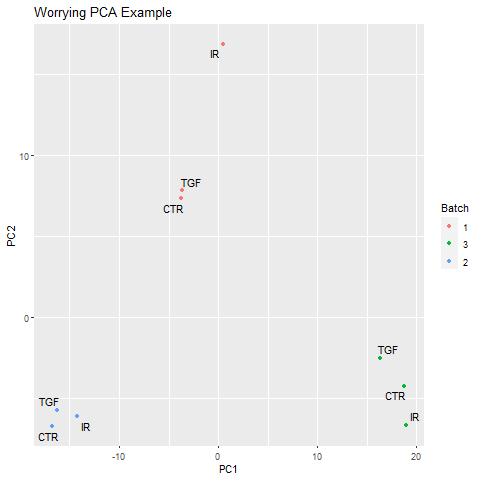

```{r setup, include=FALSE}
knitr::opts_chunk$set(echo = TRUE)
```


# Learning Objectives

- Which statistical tests are appropriate for RNA-seq data
- Using the DESeq2 package to detect differential expression
- Basic visualisation of RNA-seq counts
- Using annotation databases to map between gene identifers

# Differential expression with `DESeq2`

Now that we are happy that we have normalised the data and that the quality looks good, we can continue to testing for differentially expressed genes. There are a number of packages to analyse RNA-Seq data. Most people use `DESeq2` or `edgeR`. We will use `DESeq2` for the rest of this practical.

### Recap of pre-processing

The previous section walked-through the pre-processing and transformation of the count data. Here, for completeness, we list the minimal steps required to process the data prior to differential expression analysis.

Note that although we spent some time looking at the quality of our data , these steps are not required prior to performing differential expression so are not shown here. Remember, `DESeq2` [requires raw counts](http://bioconductor.org/packages/devel/bioc/vignettes/DESeq2/inst/doc/DESeq2.html#why-un-normalized-counts) so the `vst` transformation is not shown as part of this basic protocol.

```{r message=FALSE}
library(tximport)
library(DESeq2)
library(readr)
dirs <- list.files("salmon_quant/")
quant_files <- list.files("salmon_quant/",
                          pattern="quant.sf.gz",
                          recursive = TRUE,
                          full.names = TRUE)
names(quant_files) <- dirs

tx2gene <- read_csv("tx2gene.csv",col_names = FALSE)

txi <- tximport(quant_files,type="salmon",tx2gene = tx2gene,ignoreTxVersion = TRUE)

sampleinfo <- read_tsv("meta_data/sampleInfo_corrected.txt")


dds <- DESeqDataSetFromTximport(txi, 
                                colData = sampleinfo,
                                design = ~Treated)
dds$condition <- as.factor(dds$condition)
```

It would be a good idea to save the results of the pre-processing so we don't have to repeat it every time.

```{r}
dir.create("Robjects/",showWarnings = FALSE)
saveRDS(dds, file="Robjects/dds.rds")
```


We will be using these raw counts throughout the workshop and transforming them using methods in the `DESeq2` package. If you want to know about alternative methods for count normalisation they are covered on [this page](https://hbctraining.github.io/DGE_workshop/lessons/02_DGE_count_normalization.html).

<div class="information">
If you have problems running these steps, you can re-load a pre-processed object from the course materials

```{r eval=FALSE}
dds <- readRDS("Robjects/dds_BACKUP.rds")
```


</div>


# The DESeq workflow in brief

We have previously defined the test condition using the `design` argument when we created the object. This can be checked using the `design` function.

Typically we decide the design for the analysis when we create the DESeq2 objects, but it can be modified prior to the differential expression analysis. The design tells `DESeq2` which sample groups to compare in the differential analysis. The name specified must correspond to a column in the sample information.

```{r}
colData(dds)
design(dds) <- ~Treated
```

The counts that we have obtained via sequencing are subject to random sources of variation. The purpose of differential expression is to determine if potential sources of biological variation (e.g. counts observed from different sample groups) are greater than random noise.


The `DESeq` function runs a couple of processing steps automatically to adjust for different library size and gene-wise variability, which you can read about in the [DESeq2 vignette](http://bioconductor.org/packages/devel/bioc/vignettes/DESeq2/inst/doc/DESeq2.html#the-deseq2-model) and run some example code at the [end of this session](#Full_DESeq_workflow). 


```{r}
de_treated<- DESeq(dds)
de_treated
```


The results of the analysis are not immediately accessible, but can be obtained using the `results` function. Each row is a particular gene measured in the study (i.e. all genes in the organism being studied) and each column reports some aspect of the differential expression analysis for that gene. Note that **all genes** are reported. At this stage the gene identifiers are not very informative, something we will fix in the next section. Furthermore, the `results` function displays results in a format which is not compatible with standard data manipulation tools (i.e. `tidyverse`), so we will have to convert.

```{r}
results(de_treated)
```

# Processing the DE results using tidyverse

The output can be converted into a data frame and manipulated in the usual manner. It is recommended to use `dplyr` to manipulate the data frames with the standard set of operations detailed on the [dplyr cheatsheet](https://www.rstudio.com/wp-content/uploads/2015/02/data-wrangling-cheatsheet.pdf)

- `select` to pick which columns to display
- `filter` to restrict the rows
- `mutate` to add new variables to the data frame
- `arrange` to order the data frame according to values of a column

The `%>%` symbol refers to the [piping operation](https://sbc.shef.ac.uk/r-online/part2.nb.html#%E2%80%9CPiping%E2%80%9D) in R, which is a way of chaining operations together. 

```{r warning=FALSE, message=FALSE}
library(dplyr)
 results(de_treated, tidy=TRUE)

```

We can sort the rows by adjusted p-value and then print the first 10 rows.

```{r}
results(de_treated,tidy=TRUE) %>%
  arrange(padj) %>%  
  head(n=10)
```

Or we can sort the rows and then write the resulting data frame to a file.

```{r}
dir.create("de_analysis",showWarnings = FALSE)
 results(de_treated,tidy=TRUE) %>%
  arrange(padj) %>% 
   write_csv("de_analysis/treated_Y_vs_N_DESeq_all.csv")
```

Filtering to the differentially-expressed genes can be achieved using the `filter` function from `dplyr`.

```{r}
 results(de_treated,tidy=TRUE) %>%
  filter(padj < 0.05) %>% 
  write.csv("de_analysis/treated_Y_vs_N_DESeq_sig.csv")
```

It is also a good idea to save the results object itself so we can re-use later.

```{r}
saveRDS(de_treated, file="Robjects/de_treated.rds")

```

We can discover how many differentially-expressed genes (at a particular p-value cut-off) using the `count` function

```{r}
results(de_treated,tidy=TRUE) %>%
count(padj < 0.05)
```

Another overview of the results is to use the `plotMA` function. Each point on this plot represents and individual gene with the x- and y-axes being the overall expression level and magnitude of difference respectively. Significant genes are automatically highlighted. The fanning effect at low expression levels is often seen due to high relative fold-change at low expression levels. 

```{r}
plotMA(de_treated)
```

It is also instructive to perform a "sanity" check and plot the sample-level counts for genes with high significance. This could highlight any other technical factors that we are not currently taking into account. The plot is not particularly attractive, but is a good quick diagnostic.

```{r}
plotCounts(dds,"ENSG00000158258",intgroup = "Treated")
```

```{r}
plotCounts(dds,"ENSG00000136999",intgroup = "Treated")
```


<div class="information">
If your study involves knocking-out a particular gene, or you have some positive controls that are known in advance, it would be a good idea to visualise their expression level with `plotCounts`.
</div>

# Exercise

<div class="exercise">
- Re-run the analysis to find differentially-expressed genes between the `TGF` treated samples and `CTRL`
- Write a csv file that contains results for the genes that have a p-value less than 0.05 and a log2 fold change more than 1, or less than -1.
  - HINT: So that we don't overwrite our results so far, it may be convenient to create a new `DESeqDataSet` object for the new differential expression analysis. Check the `colData` to see which analyses can be made
- Use the `plotCounts` function to visually-inspect the most statistically-significant gene identified

```{r eval=FALSE}

dds_condition<- dds
colData(dds_condition)
## You will need to change this line to choose the correct comparison
design(dds_condition) <- ~...
```

</div>


# Changing the direction of the contrast

In this initial analysis `DESeq2` has automatically decided which member of our sample groups to use as our baseline (`CTR` in this case) so that the log2 fold changes are reported with a positive value meaning higher expression in Treated. If we want to change this behaviour we can change the `contrast` argument in the `results` function


```{r eval=FALSE}
## This should give the same as the table above
results(de_treated, contrast=c("Treated","Y","N"))
## Changing the direction of the contrast
results(de_treated, contrast=c("Treated","N","Y"))
```

If we change to performing differential expression analysis on the `condition` variable then there are various contrasts that can be made; `IR` vs `CTR`, `TGF` vs `CTR` etc. When the `results` function is run, the table that is displayed is for the contrast `TGF vs CTR`. The `resultsNames` function can tell us which other contrasts we can access.

For a factor with more than 2 groups, the `contrast` argument can be used to change the output.

```{r }
dds_condition<- dds
design(dds_condition) <- ~condition
de_condition <- DESeq(dds_condition)
results(de_condition, contrast = c("condition","IR","CTR"),tidy=TRUE)  %>%
  arrange(padj) 
```

```{r}
results(de_condition, contrast = c("condition","IR","TGF"),tidy=TRUE) %>%
  arrange(padj) 
```


# More complex designs

The examples we have used so far have performed a differential expression analysis using a named column in the `colData` object. The `DESeq2` package is capable of performing more complex analyses that can take multiple factors into consideration at the same time; so-called "multi-factor designs"

- [Multi-factor designs in DESeq2](http://bioconductor.org/packages/devel/bioc/vignettes/DESeq2/inst/doc/DESeq2.html#multi-factor-designs)

The use of such a design could be motivated by discovering sources of technical variation in our data that might obscure the biological differences we would like to compare. e.g.



In the example image above the main source of variation is the batch in which the samples were sequenced. A multi-factor analysis to compare the various conditions, but "correct" for differences in batch, would be as follows.

```{r eval=FALSE}
### Don't run this. It's just a code example
design(MY_DATA) <- ~ batch + condition
```

Likewise, if we have different treatments applied to difference cell-lines, but the main source of variation is the cell line (as in Weekly Exercise 4), the following could be used.

```{r eval=FALSE}
### Don't run this. It's just a code example
design(MY_DATA) <- ~cell_line + treatment
```


# Adding annotation to the DESeq2 results

We would love to share this list with our collaborators, or search for our favourite gene in the results. However, the results are not very useful in there current form as each row is named according to an *Ensembl* identifier. Whilst gene symbols are problematic and can change over time, they are the names that are most recognisable and make the results easier to navigate.


There are a number of ways to add annotation, but we will demonstrate how to do this using the *org.Hs.eg.db* package. This package is one of several *organism-level* packages in Bioconductor that are re-built every 6 months. These packages are listed on the [annotation section](http://bioconductor.org/packages/release/BiocViews.html#___AnnotationData) of the Bioconductor, and are installed in the same way as regular Bioconductor packages. An alternative approach is to use `biomaRt`, an interface to the [BioMart](http://www.biomart.org/) resource. BioMart is much more comprehensive, but the organism packages fit better into the Bioconductor workflow.


```{r eval=FALSE}
### Only execute when you need to install the package
install.packages("BiocManager")
BiocManager::install("org.Hs.eg.db")
# For Human
BiocManager::install("org.Hs.eg.db")
```

The packages are larger in size that Bioconductor software pacakges, but essentially they are databases that can be used to make *offline* queries. 

```{r message=FALSE}
library(org.Hs.eg.db)
```


<div class="information">
The following error may be seen loading this library on some versions of RStudio. 

```
Show in New WindowClear OutputExpand/Collapse Output
Error: package or namespace load failed for ‘org.Hs.eg.db’: .onLoad failed in loadNamespace() for 'org.Hs.eg.db', details: call: l$contains error: $ operator is invalid for atomic vectors
```

A solution is presented in this [forum post](https://coHsunity.rstudio.com/t/problem-in-loading-namespace-of-org-hs-eg-db-package-in-rstudio-server-error-operator-is-invalid-for-atomic-vectors/101789)


```{r eval=FALSE}
options(connectionObserver = NULL)
library(org.Hs.eg.db)
```


</div>


First we need to decide what information we want. In order to see what we can extract we can run the `columns` function on the annotation database.

```{r}
columns(org.Hs.eg.db)
```

We are going to filter the database by a key or set of keys in order to extract the information we want. Valid names for the key can be retrieved with the `keytypes` function.

```{r}
keytypes(org.Hs.eg.db)
```

We should see `ENSEMBL`, which is the type of key we are going to use in this case. If we are unsure what values are acceptable for the key, we can check what keys are valid with `keys`

```{r}
keys(org.Hs.eg.db, keytype="ENSEMBL")[1:10]
```


For the top gene in our analysis the call to the function would be:-

```{r eval=FALSE}
select(org.Hs.eg.db, keys="ENSG00000158258",
       keytype = "ENSEMBL",columns=c("SYMBOL","GENENAME")
)
```

Unfortunately, the authors of `dplyr` and `AnnotationDbi` have both decided to use the name `select` in their packages. To avoid confusion and errors, the following code is sometimes used:-

```{r}
AnnotationDbi::select(org.Hs.eg.db, keys="ENSG00000158258",keytype = "ENSEMBL",columns=c("SYMBOL","GENENAME"))
```


To annotate our results, we definitely want gene symbols and perhaps the full gene name. Let's build up our annotation information into a new data frame using the `select` function.

```{r}
anno <- AnnotationDbi::select(org.Hs.eg.db,keys=rownames(dds),
              columns=c("SYMBOL","GENENAME"),
              keytype="ENSEMBL")
# Have a look at the annotation
head(anno)
```

However, we have a problem that the resulting data frame has more rows than our results table. This is due to the *one-to-many* relationships that often occur when mapping between various identifiers.

```{r}
dim(anno)
dim(dds)
```

Such duplicated entries can be identified using the `duplicated` function. Fortunately, there are not too many so hopefully we won't lose too much information if we discard the entries that are duplicated. The first occurrence of the duplicated ID will still be included in the table.

```{r}
anno <- AnnotationDbi::select(org.Hs.eg.db,keys=rownames(dds),
            columns=c("ENSEMBL","SYMBOL","GENENAME","ENTREZID"),
            keytype="ENSEMBL") %>% 
filter(!duplicated(ENSEMBL))
dim(anno)
```


We can bind in the annotation information to the `results` data frame. 

```{r}
results_annotated <- results(de_treated,tidy=TRUE) %>% 
  left_join(anno, by=c("row"="ENSEMBL"))

head(results_annotated)
```


We can save the results table using the `write.csv` function, which writes the results out to a csv file that you can open in excel.

```{r}
write.csv(results_annotated,file="de_analysis/treatment_Y_vs_N_DESeq_annotated.csv",row.names=FALSE)
saveRDS(results_annotated, file="Robjects/treatment_Y_vs_N_DESeq_annotated.rds")
```


# Exercise

<div class="exercise">

- Join the annotation table to your results from the DESeq analysis of `TGF` vs `CTR`. Save the resulting data frame as an R object. e.g. `Robjects/results_TGF_vs_CTR_annotated.rds`
- The publication gives examples of `COL1A1`, `COL1A2` and `COL3A1` as genes that are *up-regulated* in TGF-treated samples vs controls (Figure 6C). Use your data to verify this by 
  + i) plotting the counts for these genes 
  + ii) extracting their p-values


</div>

```{r}


```


### Exporting normalized counts

The `DESeq` workflow applies *median of ratios normalization* that accounts for differences in sequencing depth between samples. The user does not usually need to run this step. However, if you want a matrix of counts for some application outside of Bioconductor the values can be extracted from the `dds` object.

```{r}
dds <- estimateSizeFactors(dds) 
countMatrix <-counts(dds, normalized=TRUE)
head(countMatrix)
write.csv(countMatrix,file="normalized_counts.csv")
```


# Full DESeq workflow

The median of ratios normalisation method is employed in DESeq2 to account for *sequencing depth* and *RNA composition*. Let's go through a short worked example (courtesy of [https://hbctraining.github.io/DGE_workshop/lessons/02_DGE_count_normalization.html](here)) to explain the process.

```{r}
## create a small example matrix of "counts"
test_data <- matrix(c(1489,22,793,76,521,906,13,410,42,1196),nrow=5)
rownames(test_data) <- c("EF2A","ABCD1","MEFV","BAG1","MOV10")
colnames(test_data) <- c("SampleA","SampleB")
test_data
```

Firstly, an "average" or reference sample is created that represents the counts on a typical sample in the dataset. The *geometric mean* is used rather than the *arithmetic* mean. In other words the individual counts are multiplied rather than summed and the measure should be more robust to outliers.


```{r}
psuedo_ref <- sqrt(rowProds(test_data))
psuedo_ref
```

A ratios of sample to "psuedo reference" are then calculated for each gene. We are assuming that most genes are not changing dramatically, so this ratio should be somewhere around 1.

```{r}
test_data/psuedo_ref
```

`DESeq2` defines size factors as being the *median* of these ratios for each sample (median is used so any outlier genes will not affect the normalisation). 

```{r}
norm_factors <- colMedians(test_data/psuedo_ref)
norm_factors
```

Individual samples can then normalised by dividing the count for each gene by the corresponding normalization factor.

```{r}
test_data[,1] / norm_factors[1]
```

and for the second sample...

```{r}
test_data[,2] / norm_factors[2]

```

The size factors for each sample in our dataset can be calculated using the `estimateSizeFactorsForMatrix` function.

```{r}
sf <- estimateSizeFactorsForMatrix(assay(dds))
sf
```

The estimation of these factors can also take gene-lengths into account, and this is implemented in the `estimateSizeFactors` function. Extra normalization factor data is added to the `dds` object.


```{r eval=FALSE}
dds <- estimateSizeFactors(dds)
dds
```

In preparation for differential expression DESeq2 also need a reliable estimate of the variability of each gene; which it calls *dispersion*. 

```{r eval=FALSE}
dds <- estimateDispersions(dds)
dds

```

A statistical test can then be applied. As the data are count-based and not normally-distributed a t-test would not be appropriate. Most tests are based on a *Poisson* or *negative-binomial* distribution; negative binomial in the case of `DESeq2`. Although you might not be familiar with the negative binomial, the results should be in a familiar form with fold-changes and p-values for each gene.

```{r eval=FALSE}
dds <- nbinomWaldTest(dds)
```

It may seem like there is a lot to remember, but fortunately there is one convenient function that will apply the three steps. The messages printed serve as reminders of the steps included.


# Acknowledgements

**Original Authors: Belinda Phipson, Anna Trigos, Matt Ritchie, Maria Doyle, Harriet Dashnow, Charity Law**, **Stephane Ballereau, Oscar Rueda, Ashley Sawle**
Based on the course [RNAseq analysis in R](http://combine-australia.github.io/2016-05-11-RNAseq/) delivered on May 11/12th 2016 and modified by Cancer Research Uk Cambridge Centre for the [Functional Genomics Autumn School 2017](https://bioinformatics-core-shared-training.github.io/cruk-autumn-school-2017/)

## Resources and data files

This material has been created using the following resources:  

- http://www.statsci.org/smyth/pubs/QLedgeRPreprint.pdf 
- http://monashbioinformaticsplatform.github.io/RNAseq-DE-analysis-with-R/99-RNAseq_DE_analysis_with_R.html  
- http://bioconductor.org/packages/devel/bioc/vignettes/DESeq2/inst/doc/DESeq2.html
- https://bioconductor.github.io/BiocWorkshops/rna-seq-data-analysis-with-deseq2.html